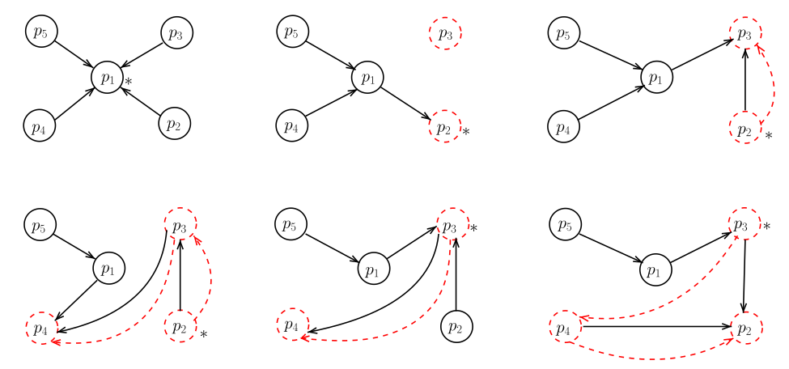
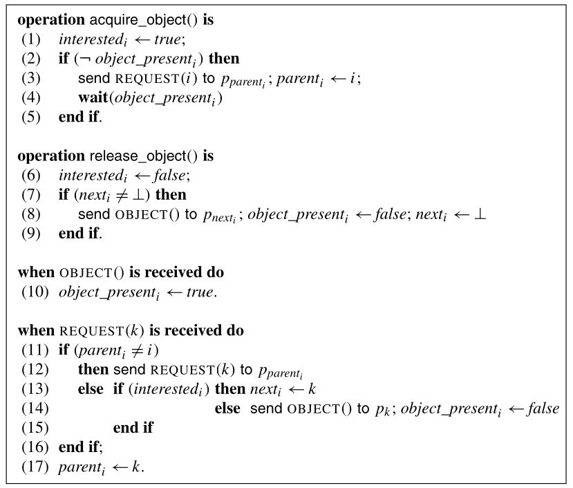

# Distributed Adaptive Navigational Algorithm

An implementation of an adaptive navigational algorithm for mobile objects based on a distributed queue and underlying spanning tree following the definition put forward by Michel Raynal in _Distributed Algorithm's for Message Passing Systems._

### Example graph:

### Raynal's psuedocode:

